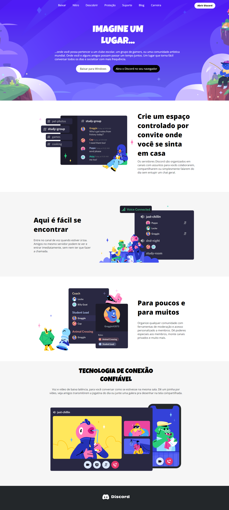
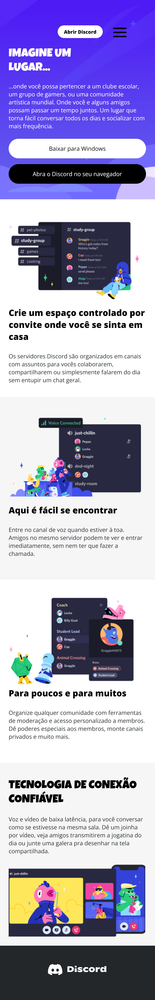

<h1 align="center">DISCORD CLONE</h1>

  

## 🚀 Tecnologias

Esse projeto foi desenvolvido com as seguintes tecnologias:

- HTML e CSS
- JavaScript 
- Git e Github

## 💻 Projeto
Projeto criado com o intuíto de praticarmos os conceitos de responsividade, para esse desafio segui o conceito de mobile first, e com o passar do projeto fui contrúindo a layout para os demais dispostivos, optei por utilizar flexbox na contrução do projeto, e para dispositivos móveis também contruí um menu hamburguer com JavaScript.

## 📱 Mobile versão

  

## :memo: Licença